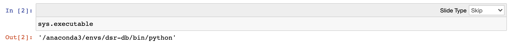
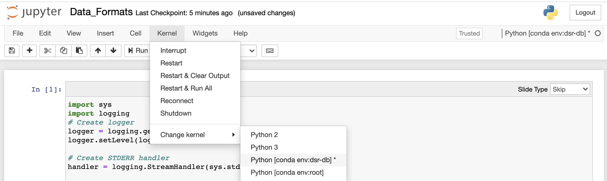

# DSR - Databases

### Creating a Conda Environment for this course

```
conda create -n dsr-db python==3.7
```

Activate the conda environment

```
conda activate dsr-db

# Alternatively you can use 

source activate dsr-db # (this is deprecated)
```


Verify your which `pip` you are using

```
(dsr-db) ➜  dsr git:(master) ✗ which pip
/anaconda3/envs/dsr-db/bin/pip
```

Finally, install the pip requirements. 

```
pip install -r requirements.txt
```

### Starting a jupyter server

Let's use a Conda extension that makes conda environments available for Jupyter notebooks. 

```
conda install -n dsr-db ipykernel nb_conda_kernels
```

And start a notebook server:

```
jupyter notebook
```


### Choosing the right Kernel

Open the notebook: `1_Data_Formats/Data_Formats.ipynb`

And now validate that the notebook is using the right Kernel.  



If not, you can change the kernel:


